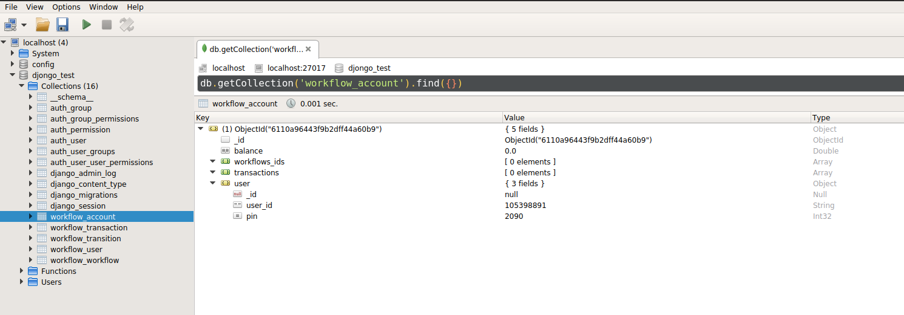
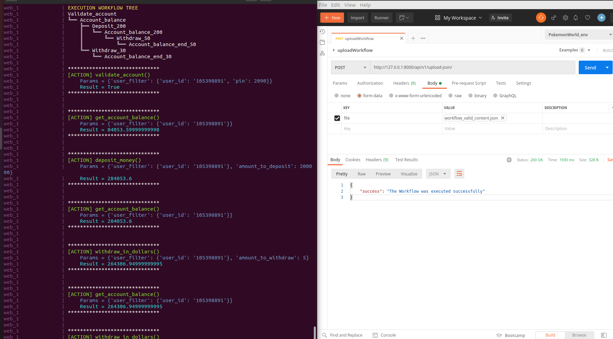

# ACMETest

## Context
This project execute one workflow for ACME Bank, read file json since POST service.
To solve the problem the data structure "General tree" was used


## Installation

##### requirements
    [Docker] https://docs.docker.com/engine/install/
    [DockerCompose] https://docs.docker.com/compose/install/
    [Mongo] https://docs.mongodb.com/manual/installation/

1. Build Docker
   ```sh
    >>[DirProject] docker-compose build
   ```
2. Run Docker
   ```sh
    >>[DirProject] docker-compose up
   ```

## Usage

0. Create this document in collection "workflow_account" in your database:
   ```json
    {
        "balance" : 0.0,
        "workflows_ids" : [],
        "transactions" : [],
        "user" : {
            "user_id" : "105398891",
            "pin" : 2090
        }
   }
   ```
   

1. Call web service: Use one client like "Postman"
    ```sh
    [POST] http://127.0.0.1:8000/api/v1/upload-json/
    ```

   upload file 'workflow/tests/fixtures/workflow_valid_content.json'

   if you run the endpoint fine you should get a message like this:
   


## Unit Tests

1. For run the test (see in workflow/tests/):

    ```sh
    >>[DirProject] docker-compose exec web python manage.py test
    ```
   


## Tech
The technologies used for this project were the following:
* [Python3] 
* [treelib] https://treelib.readthedocs.io/en/latest/index.html
* [Django]
* [Djongo] https://www.djongomapper.com/
* [Mongo]
* [Docker]
* https://github.com/jfajardo/TRM-Colombia
